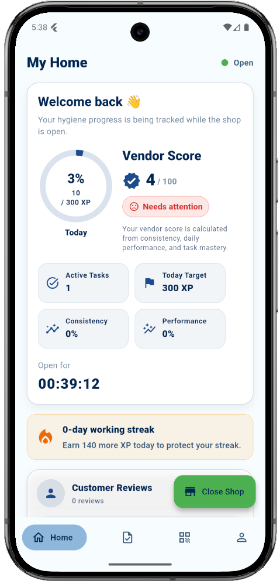
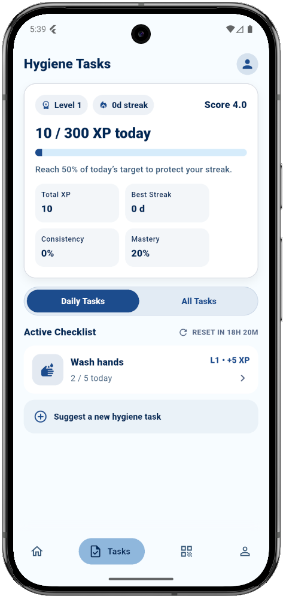
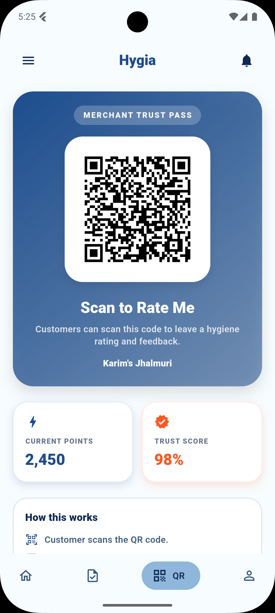
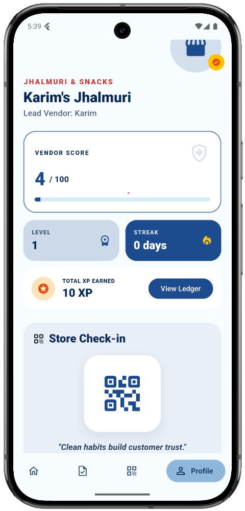

# Hygia

**Hygia** is a Flutter-based mobile application prototype designed to support better hygiene practices among street food vendors through persuasive design and gamification.

The project was developed as part of a Master's thesis on using mobile persuasive technology to encourage hygiene-related behaviour change among street food vendors in Bangladesh. Hygia helps vendors track daily hygiene tasks, earn XP, improve their vendor score, maintain streaks, and share a QR-based trust/rating profile with customers.

---

## Preview

<p align="center">
  
  
  
  
</p>

---

## About the Project

Street food is an important part of everyday life in Bangladesh. It is affordable, accessible, culturally rich, and supports many small vendors. However, hygiene practices in informal food vending environments can be difficult to maintain consistently due to limited infrastructure, lack of monitoring, low-cost operating conditions, and behaviour gaps.

Hygia explores how a mobile application can support hygiene behaviour change by combining:

* **Daily hygiene task tracking**
* **Gamification**
* **Vendor score**
* **XP and level progression**
* **Task mastery**
* **Streaks**
* **Customer-facing QR code**
* **Offline-first local data storage**
* **Firebase-based cloud backup and profile/rating support**

The goal of the prototype is not to replace formal food safety inspection systems, but to demonstrate how persuasive technology can encourage vendors to build cleaner and more consistent daily habits.

---
## Project Structure

A simplified structure of the project may look like this:

```text
lib/
├── core/
│   ├── local_db/
│   ├── theme/
│   └── utils/
│
├── features/
│   ├── auth/
│   ├── home/
│   ├── tasks/
│   ├── profile/
│   └── qr/
│
├── repositories/
│   ├── auth_repository.dart
│   ├── vendor_repository.dart
│   └── task_repository.dart
│
├── services/
│   └── task_progress_service.dart
│
└── main.dart
```

The exact structure may vary depending on the current version of the prototype.

---

## Getting Started

Follow these steps to run the project locally.

---

## Prerequisites

Make sure you have the following installed:

* Flutter SDK
* Dart SDK
* Android Studio or VS Code
* Android Emulator or physical Android device
* Git
* Firebase CLI
* FlutterFire CLI

Check Flutter installation:

```bash
flutter doctor
```

Install Firebase CLI:

```bash
npm install -g firebase-tools
```

Install FlutterFire CLI:

```bash
dart pub global activate flutterfire_cli
```

---

## Installation

### 1. Clone the repository

```bash
git clone https://github.com/YOUR_USERNAME/hygia.git
cd hygia
```

Replace `YOUR_USERNAME` with your GitHub username.

---

### 2. Install dependencies

```bash
flutter pub get
```

---

### 3. Configure Firebase

Create a Firebase project from the Firebase Console.

Enable the following Firebase services:

* Firebase Authentication
* Cloud Firestore

Then run:

```bash
firebase login
flutterfire configure
```

This will generate the Firebase configuration file required by the Flutter app.

For Android, make sure the following file exists:

```text
android/app/google-services.json
```

If it is missing, download it from Firebase Console and place it in the correct directory.

---

### 4. Generate local database files

If the project uses Drift code generation, run:

```bash
dart run build_runner build
```

If there are conflicts with generated files, run:

```bash
dart run build_runner build --delete-conflicting-outputs
```

---

### 5. Run the app

Start an Android emulator or connect a physical Android device.

Then run:

```bash
flutter run
```

---

## Firebase Setup Notes

For Firebase Authentication, enable the sign-in method used in the project, for example:

* Email/password authentication

For Firestore, create the required collections based on the app structure, such as:

```text
users
vendors
vendor_ratings
```

During development, make sure your Firestore security rules allow authenticated users to read and write their own data.

A simple development-only rule may look like this:

```js
rules_version = '2';

service cloud.firestore {
  match /databases/{database}/documents {
    match /{document=**} {
      allow read, write: if request.auth != null;
    }
  }
}
```

Do not use open development rules in production.

---

## Running on Android

The prototype is mainly targeted for Android.

Recommended setup:

```bash
flutter devices
flutter run -d <device_id>
```

To build an APK:

```bash
flutter build apk
```

The generated APK will be available in:

```text
build/app/outputs/flutter-apk/
```

---

## Screenshots Folder Setup

To display screenshots in this README, create a folder:

```text
assets/readme/
```

Then place the screenshots there:

```text
assets/readme/Screenshot_1778556294.png
assets/readme/Screenshot_1778556300.png
assets/readme/Screenshot_1778556308.png
assets/readme/Screenshot_1778556305.png
```

If your image names are different, update the image paths in the Preview section.

---

## Current Prototype Status

This project is a research prototype developed for a Master's thesis.

Implemented or partially implemented features include:

* User authentication
* Vendor registration
* Vendor profile
* Hygiene task tracking
* Daily XP calculation
* Vendor score
* Vendor level
* Streak system
* Shop open/close state
* QR-code based rating interface
* Local offline-first storage
* Firebase integration

Possible future improvements include:

* Full multilingual support: English, Bengali, and German
* Push notifications and task reminders
* More advanced customer rating flow
* Vendor leaderboard
* Public vendor trust profile
* Admin or researcher dashboard
* Stronger cloud synchronization and conflict resolution
* Field evaluation with real vendors

---

## Research Context

Hygia was designed as part of a Master's thesis investigating how persuasive mobile technology can support hygiene behaviour change among street food vendors.

The application applies ideas from:

* Persuasive System Design
* Gamification
* Behaviour-change support systems
* Mobile health and hygiene interventions
* Offline-first application design

---

## Disclaimer

Hygia is a prototype and research artefact. It is not an official food safety certification system and should not be used as a replacement for government inspection, public health regulation, or professional food safety training.

---

## Author

**Nafees Mohammad Adil**

Master's Thesis Project
University of Rostock

---

## License

This project is currently intended for academic and research purposes.

You may update this section depending on your chosen license, for example:

```text
MIT License
```

or

```text
All rights reserved.
```
